# Sobel

本次尝试如下问题:

- 如何使用OpenCV函数 [Sobel](http://opencv.willowgarage.com/documentation/cpp/image_filtering.html#cv-sobel) 对图像求导。
- 如何使用OpenCV函数 [Scharr](http://opencv.willowgarage.com/documentation/cpp/image_filtering.html#cv-scharr) 更准确地计算 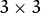 核的导数。

## 原理

1. 对图像进行求导是重要的，当我们需要检测图像中的 *边缘* ，如下图:

<div align=center>
   
</div>

   你可以看到在 *边缘* ,相素值显著的 *改变* 了。表示这一 *改变* 的一个方法是使用 *导数* 。 梯度值的大变预示着图像中内容的显著变化。

2. 用更加形象的图像来解释,假设我们有一张一维图形。下图中灰度值的”跃升”表示边缘的存在:

<div align=center>
   
</div>

3. 使用一阶微分求导我们可以更加清晰的看到边缘”跃升”的存在(这里显示为高峰值)

<div align=center>
   
</div>

4. 从上例中我们可以推论检测边缘可以通过定位梯度值大于邻域的相素的方法找到(或者推广到大于一个阀值).

### Sobel算子

1. Sobel 算子是一个离散微分算子 (discrete differentiation operator)。 它用来计算图像灰度函数的近似梯度。

2. Sobel 算子结合了高斯平滑和微分求导。

#### 计算

假设被作用图像为 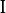: 

1. 在两个方向求导:

   1. **水平变化**: 将  与一个奇数大小的内核 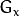 进行卷积。比如，当内核大小为3时,  的计算结果为:

<div align=center>
   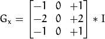
</div>

   2. **垂直变化**: 将:math:I 与一个奇数大小的内核 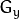 进行卷积。比如，当内核大小为3时,  的计算结果为:

<div align=center>
   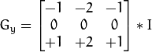

<br>
   
</div>

2. 在图像的每一点，结合以上两个结果求出近似 *梯度*:

<div align=center>
   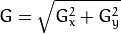
</div>

   有时也用下面更简单公式代替:

<div align=center>
   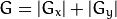
</div>

   **Note**
   当内核大小为 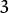 时, 以上Sobel内核可能产生比较明显的误差(毕竟，Sobel算子只是求取了导数的近似值)。 为解决这一问题，OpenCV提供了 [Scharr](http://opencv.willowgarage.com/documentation/cpp/image_filtering.html#cv-scharr) 函数，但该函数仅作用于大小为3的内核。该函数的运算与Sobel函数一样快，但结果却更加精确，其内核为:

<div align=center>
   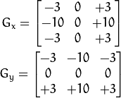
</div>

   关于( [Scharr](http://opencv.willowgarage.com/documentation/cpp/image_filtering.html#cv-scharr) )的更多信息请参考OpenCV文档。在下面的示例代码中,你会发现在 [Sobel](http://opencv.willowgarage.com/documentation/cpp/image_filtering.html#cv-sobel) 函数调用的上面有被注释掉的 [Scharr](http://opencv.willowgarage.com/documentation/cpp/image_filtering.html#cv-scharr) 函数调用。 反注释Scharr调用 (当然也要相应的注释掉Sobel调用)，看看该函数是如何工作的。

## 代码解释

1. 首先申明变量:

   ```C++
   Mat src, src_gray;
   Mat grad;
   char* window_name = "Sobel Demo - Simple Edge Detector";
   int scale = 1;
   int delta = 0;
   int ddepth = CV_16S;
   ```

2. 装载原图像 *src*:

   ```C++
   // 装载图像
   src = imread("cat.jpg");
   if (!src.data)
   {
   	return -1;
   }
   ```

3. 第一步对原图像使用 [GaussianBlur](http://opencv.willowgarage.com/documentation/cpp/image_filtering.html#cv-gaussianblur) 降噪 ( 内核大小 = 3 )

   ```C++
   GaussianBlur(src, src, Size(3, 3), 0, 0, BORDER_DEFAULT);
   ```

4. 将降噪后的图像转换为灰度图:

   ```C++
   cvtColor(src, src_gray, CV_RGB2GRAY);
   ```

5. 第二步,在 *x* 和 *y* 方向分别” *求导* “，并将中间结果转换到 *CV_8U*。 为此，我们使用函数 [Sobel](http://opencv.willowgarage.com/documentation/cpp/image_filtering.html#cv-sobel) 和[convertScaleAbs](http://opencv.willowgarage.com/documentation/cpp/image_filtering.html#cv-convertScaleAbs) :

   ```C++
   // 创建 grad_x 和 grad_y 矩阵
   Mat grad_x, grad_y;
   Mat abs_grad_x, abs_grad_y;
   
   // 求 X方向梯度
   Sobel(src_gray, grad_x, ddepth, 1, 0, 3, scale, delta, BORDER_DEFAULT);
   convertScaleAbs(grad_x, abs_grad_x);
   
   // 求Y方向梯度
   Sobel(src_gray, grad_y, ddepth, 0, 1, 3, scale, delta, BORDER_DEFAULT);
   convertScaleAbs(grad_y, abs_grad_y);
   ```

   该函数接受了以下参数:

   - *src_gray*: 在本例中为输入图像，元素类型 *CV_8U*
   - *grad_x*/*grad_y*: 输出图像.
   - *ddepth*: 输出图像的深度，设定为 *CV_16S* 避免外溢。
   - *x_order*: **x** 方向求导的阶数。
   - *y_order*: **y** 方向求导的阶数。
   - *scale*, *delta* 和 *BORDER_DEFAULT*: 使用默认值

   注意为了在 *x* 方向求导我们使用: 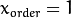 ， 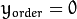. 采用同样方法在 *y* 方向求导。

6. 将两个方向的梯度相加来求取近似 *梯度* (注意这里没有准确的计算，但是对我们来讲已经足够了)。

   ```C++
   // 合并梯度(近似)
   addWeighted(abs_grad_x, 0.5, abs_grad_y, 0.5, 0, grad);
   ```

7. 最后，显示结果:

   ```C++
   imshow(window_name, grad);
   ```